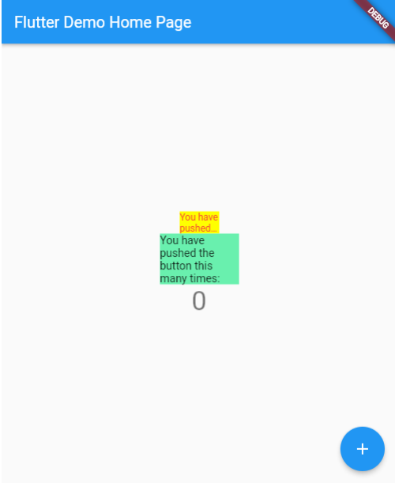
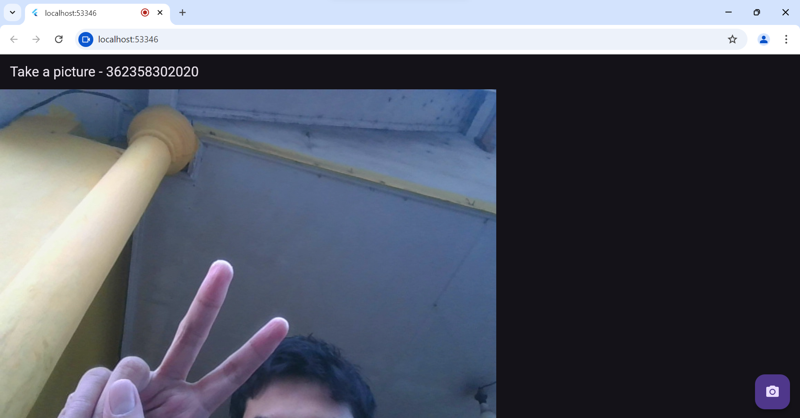
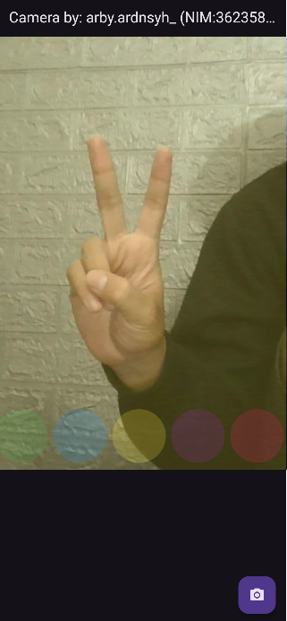

NAMA : MOH. ARBI ARDIANSYAH

NIM : 362358302150

KELAS : 2B TRPL

                                              LAPORAN PRAKTIKUM 
                                      Menerapkan Plugin di Project Flutter

HASIL PRAKTIKUM PLUGIN:

HASIL PRAKTIKUM 1:

HASIL PRAKTIKUM 2:

#MENGUBAH GAMBAR MENJADI KAMERA DAN MENERAPKAN FILTER

#HASIL GAMBAR

